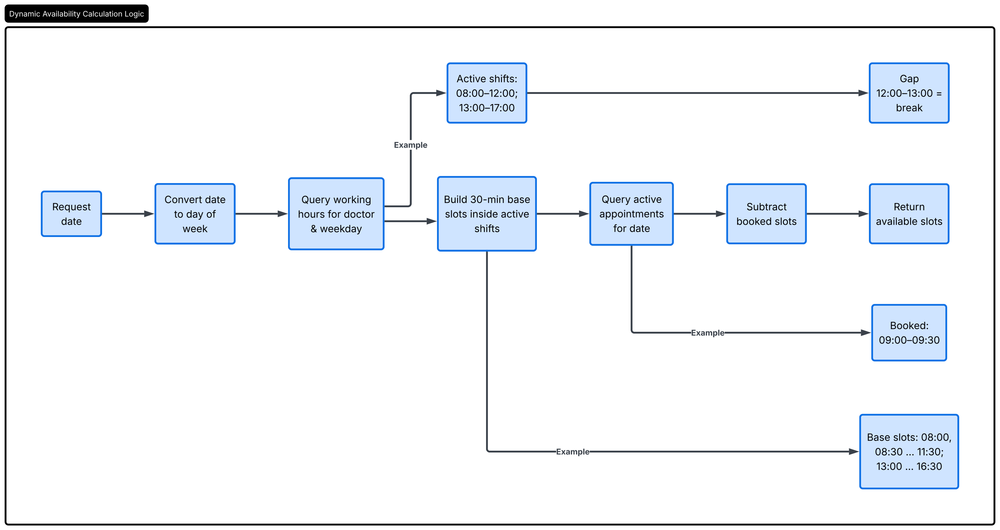

# Doctor's Appointment
- Savannah Informatics Backend Developer Take-Home Assessment
- The system is implemented in *Go* using the *Gin Gonic* web framework and *PostgreSQL* as the persistent datastore.
- The architecture is designed to be highly maintainable, prevent booking conflicts (race conditions), and support real-world clinic constraints such as irregular shift structures and midday breaks.

## System Design

### Entity Relationship Diagram (ERD)
- To represent a highly realistic clinic setup without over-complicating storage requirements, we distinguish between standard working hour frames (shifts) and actual bookings. (instead of storing slots, we dynamically generate on-the-fly)
- *Working Hours (Shift)*: Represents active, non-overlapping daily working shifts for a doctor on specific days of the week. By allowing multiple rows per day of the week, this entity seamlessly accomodates midday breaks.
- *Appointment*: Represents a 30-minute booking reservation linking a `Patient` and a `Doctor` on a specific calendar date.

## Dynamic Availability Calculation Logic
- Instead of pre-generating empty time slots in the database (which creates data-synchronization overhead and bloat), the system *calculates slot availability dynamically on-the-fly*.

## Concurrency Handling & Race Conditions
- In high-traffic systems (scalability), multiple users might attempt to book the exact same 30-minute slot simultenously. If untreated, this leads to a **double-booking bug**
- The *Solution*: `Serializable Transactions & Pessimistic Locking`

## Architecture (above) Trade-offs
| Design Dimension | Selected Approach | Alternatives Considered | Trade-off Analysis |
| :------- | :------: | :-------: | ------- |
| Slot Generation | Dynamic Calculation | Static Pre-generation | `Pros`: Dynamic logic allows immediate adjustment of doctor working hours without retroactively editing rows. Decreases DB footprint. `Cons`: Marginally higher CPU load on query endpoints (negated by Redis caching if needed in future expansion). |
| Concurrency Control | Database Lock (FOR UPDATE) | Go-Mutex / Distributed Locks | `Pros`: Robust and simple. Ensures consistency across multiple instances of the backend container without needing Redis Redlock orchestration. `Cons`: Holds open transactional resources. For scale, locks are restricted exclusively to individual doctor scopes. |
| Data Integrity | DB-level Constraints | Application-level validation only | `Pros`: Guarantees absolute data integrity even if another microservice accesses the database or manual maintenance queries run. `Cons`: Tight coupling between system rules and database engine schema. |

## Local Setup and Deployment Notes
- **Language Runtime**: Go 1.21+
- **Framework**: Gin Gonic (*github.com/gin-gonic/gin*)
- **Database**: PostgreSQL 15+
- **CI/CD Engine**: Github Actions (config configured under *.github/workflows/deploy.yml*)
- **Target Cloud Platform**: _

## Author
[waltertaya](https://waltertaya.pages.dev/)
